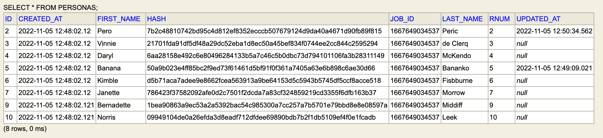

# spring-batch-demo-app

- Spring batch
- 2 jobs: insert from CSV to the DB, update second table or delete if no longer in the CSV table (If jobId is different in the DB, data needs to be deleted)
- Rest controller to start initial job, start second job

To start initial job:
```bash
curl -X POST "http://localhost:8181/api/v1/batch/start/zero
```

To start second job
```bash
curl -X POST "http://localhost:8181/api/v1/batch/start
```


Second table after CSV table update/delete:


